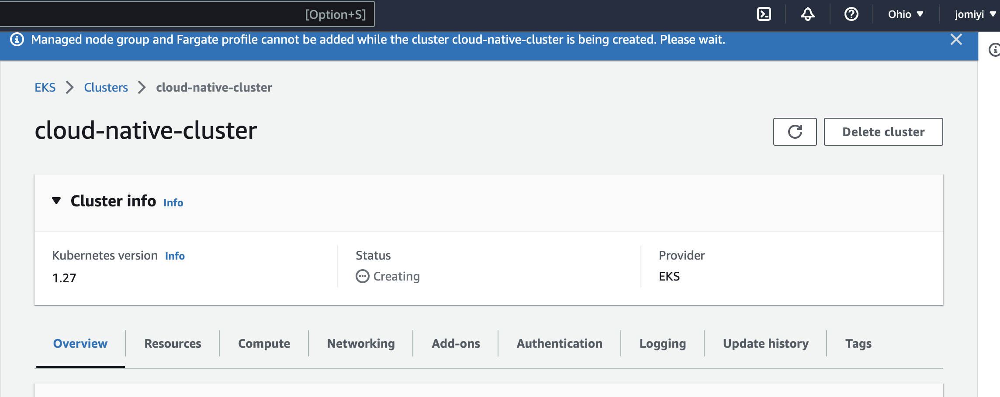
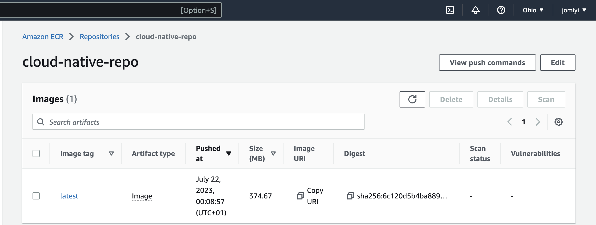
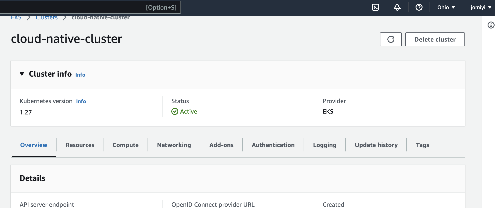
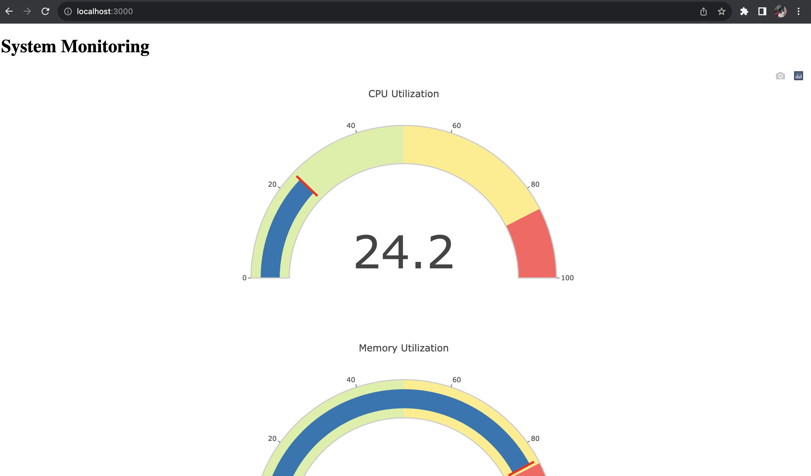

# CLOUD NATIVE MONITORING APP

Deploy a Simple Cloud monitoring application on kubernetes

## Project architecture
[project architecture](images/image1.png)

## Starting up the application locally
```
python3 app.py

```

[app running locally](images/image2.png)

## Docker Code Setup
```
#build docker image from dockerfile
docker build -t my-flask-app .

#run container from docker image
docker run -d -p 3000:3000 my-flask-app
```

[docker image built](images/image3.png)
[docker container running](images/image4.png)

## Create ECR and push image to the Repo
```

#AWS CLI command
aws ecr create-repository --repository-name cloud-native-repo

```




## Create EKS cluster and nodes


## Create Kubernetes Deployment and Service using Python
```
python3 eks.py

```

